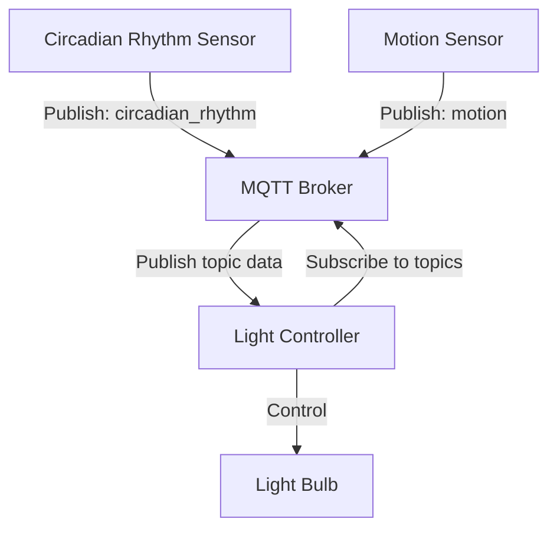

# mqtt-iot-system
A proof-of-concept IoT system designed to demonstrate IoT workflows using MQTT publish-subscribe paradigm.

## Why This Project?
This project provided me with the opportunity to:
1. Learn how IoT devices communicate with a backend via MQTT.
2. Integrate with Flask and Flask-MQTT to handle IoT data.
3. Validate workflows using Pytest for test automation.

## Tools and Libraries
Flask, Flask-MQTT, Pytest.

## System Architecture
Here is a high level diagram illustrating what the system is composed of:

- Publishers: The Circadian Rhythm Sensor and Motion Sensor act as MQTT publishers, sending sensor data to the MQTT
  broker.
- Broker: The MQTT broker facilitates communication by relaying data from the publishers to the subscriber.
- Subscriber (Flask Backend): The Light Controller subscribes to the sensor data topics, processes the information,
  and sends commands to the Light Bulb to control the light's behavior based on sensor data (e.g., adjusting light
  intensity or turning it on/off).
- Interaction: This design demonstrates the decoupling of sensor data collection and light control, showcasing a typical
  IoT publish-subscribe pattern for smart lighting systems, as well as the command pattern the light control employs.