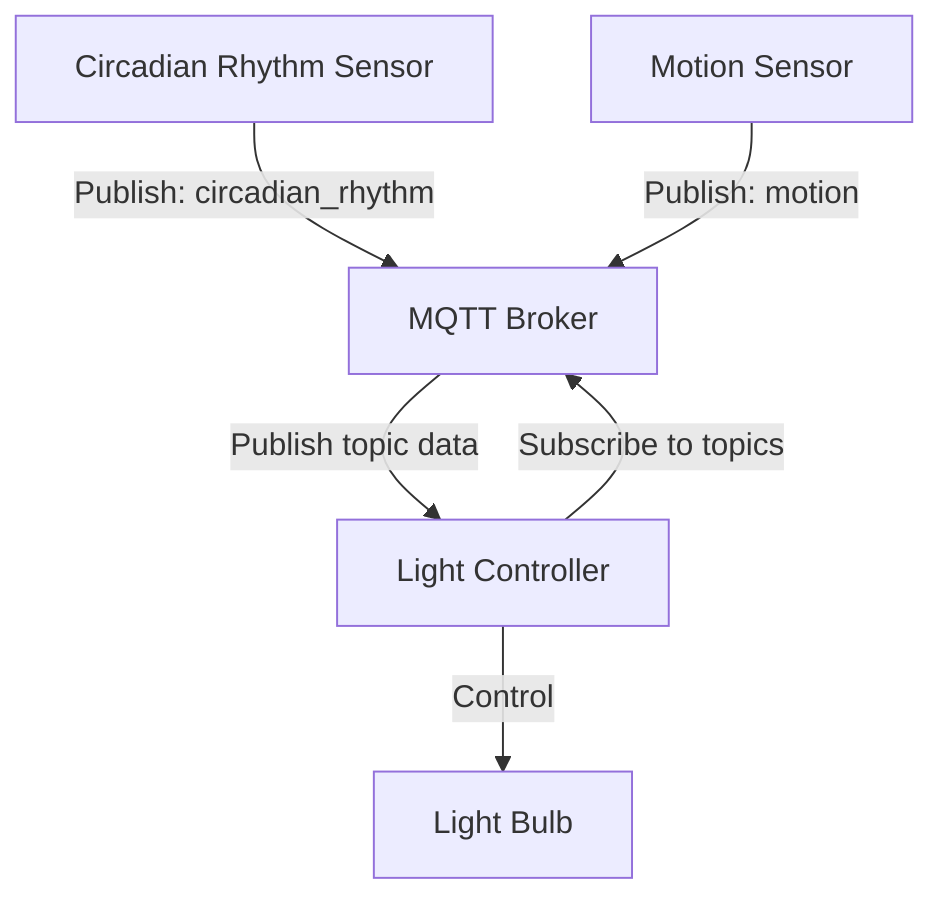

# mqtt-iot-system
A proof-of-concept IoT system designed to demonstrate IoT workflows using MQTT publish-subscribe paradigm.

## Contents
* [Why this project?](#why-this-project)
* [Tools and Libraries](#tools-and-libraries)
* [System Architecture](#system-architecture)
* [How to run](#how-to-run)
* [How to run tests and other dev tools](#how-to-run-tests-and-other-dev-tools)
---

## Why This Project?
This project provided me with the opportunity to:
1. Learn how IoT devices communicate with a backend via MQTT.
2. Integrate with Flask and Flask-MQTT to handle IoT data.
3. Validate workflows using Pytest for test automation.


## Tools and Libraries
Flask, Flask-MQTT, Pytest.


## System Architecture
The system imitates a real-life smart lighting setup with two demonstrated features: circadian rhythm lighting,
where light intensity mimics natural outdoor lighting based on the sun, and motion-based lighting, where a motion
sensor sends signals upon detecting movement, enabling the system to adjust the lights accordingly.

Here is a high level diagram illustrating what the system is composed of:


- **Publishers**: The Circadian Rhythm Sensor and Motion Sensor act as MQTT publishers, sending sensor data to the MQTT
  broker.
- **Broker**: The MQTT broker facilitates communication by relaying data from the publishers to the subscriber.
- **Subscriber (Flask Backend)**: The Light Controller subscribes to the sensor data topics, processes the information,
  and sends commands to the Light Bulb to control the light's behavior based on sensor data (e.g., adjusting light
  intensity or turning it on/off).
- **Interaction**: This design demonstrates the decoupling of sensor data collection and light control, showcasing a typical
  IoT publish-subscribe pattern for smart lighting systems, as well as the command pattern the light control employs.

## How to run
### Setting up
1. Clone this repository then go to the root directory `mqtt-iot-system/`.
1. Run `pipenv install` to get all the project's requirements from Pipfile. To run `pipenv`, you need to have it
   installed on your machine.
1. Run `pipenv shell` to activate your virtual environment.
1. Generate a Secure Secret Key:
   Flask requires a `SECRET_KEY` to securely sign sessions and cookies. For production, this key must be kept secret
   and should be generated securely. You can generate a Flask secret key easily using Python's `secrets` module.

   Run the following Python code to generate a secure secret key:

   ```python
   import secrets

   # Generate a secure random string of 24 characters
   secret_key = secrets.token_urlsafe(24)
 
   print(secret_key)  # This will output a string like 'bf6Jt2x2Vc7-44VczlVX3A'
   ```
1. Copy the generated secret key, then create a `.env` file where you add the key you copied along with other 
   environment variables. Your `.env` should look somewhat like this:
   ```
   SECRET_KEY=bf6Jt2x2Vc7-44VczlVX3A
   MQTT_BROKER_URL=broker.emqx.io  # or any MQTT broker you want to use
   ```

### Running
From now on, all you need to do is go to the root directory of the project, then:
1. Activate your virtual environment by running `pipenv shell`.
1. Start the application by running `flask --app application/app run`.
1. Observe the output.

### Sample output
```
(mqtt-iot-system) ➜  mqtt-iot-system git:(master) ✗ flask --app application/app run                                                                                                                                                                                   19:14:59
Starting circadian rhythm publisher...
Starting motion publisher...

Published on topic --> iot/lights/circadian_rhythm: sunrise
 * Serving Flask app 'application/app'

Published on topic --> iot/lights/motion: {'motion_detected': True}
 * Debug mode: off
WARNING: This is a development server. Do not use it in a production deployment. Use a production WSGI server instead.
 * Running on http://127.0.0.1:5000
Press CTRL+C to quit

Connected to MQTT broker successfully
Subscribed to topics iot/lights/circadian_rhythm and iot/lights/motion

Published on topic --> iot/lights/circadian_rhythm: morning

Received circadian rhythm message: morning
Adjusting light to intensity: 100%

Published on topic --> iot/lights/circadian_rhythm: sunset

Received circadian rhythm message: sunset
Adjusting light to intensity: 30%

Published on topic --> iot/lights/circadian_rhythm: night

Received circadian rhythm message: night
Adjusting light to intensity: 5%

Published on topic --> iot/lights/circadian_rhythm: sunrise

Received circadian rhythm message: sunrise
Adjusting light to intensity: 50%

Published on topic --> iot/lights/circadian_rhythm: morning

Received circadian rhythm message: morning
Adjusting light to intensity: 100%

Published on topic --> iot/lights/motion: {'motion_detected': True}

Received motion sensor message: {'motion_detected': True}
Adjusting light to intensity: 100%

Published on topic --> iot/lights/circadian_rhythm: sunset

Received circadian rhythm message: sunset
Adjusting light to intensity: 30%

Published on topic --> iot/lights/circadian_rhythm: night

Received circadian rhythm message: night
Adjusting light to intensity: 5%
```

## How to run tests and other dev tools
To run the tests and use other dev-packages for various purposes like test coverage or flake8 reports, you need to run
`pipenv install --dev`.
- Tests: run command `pytest` in the project root.
- Test coverage report: run `pytest --cov=application` in the project root.
- Ruff: run `ruff check` in the project root.
- Flake8 reports: run `flake8` in the project root.
- Mypy for type checking: run `mypy application` in the project root.